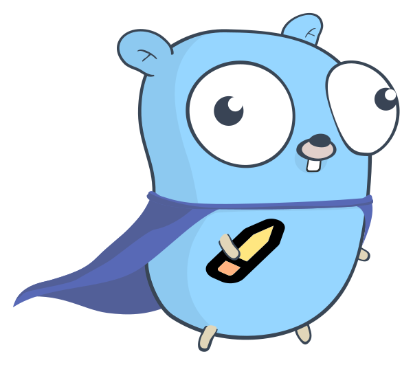

# Ołówek
<p align="center">
  
</p>

Ołówek [ɔˈwuvɛk] - configure your Nginx with applications deployed on Mesos/Marathon.

**Features:**

* Custom templates with Go `text/template`
* Uses Marathon event stream for updates *(requires at least Marathon v0.9.0)*
* Automatic discovery of all applications running on Marathon

## Installation

1. Get pre-compiled binary from `releases` page
2. Edit configuration *(default location is `/etc/olowek/olowek.json`)*:

```json
{
  "scope": "internal",
  "marathon": "http://127.0.0.1:8080,127.0.0.1:8080",
  "nginx_config": "/etc/nginx/conf.d/services.conf",
  "nginx_template": "/etc/olowek/services.tpl",
  "nginx_cmd": "/usr/sbin/nginx"
}
```
3. Start olowek

## Template

Ołówek uses the standard Go (Golang) [template package](https://golang.org/pkg/text/template/) to generate Nginx configuration files.

All labels and environment variables from applications are available.

### Examples

**Iterating applications and generating upstream block:**

```
{{ range $id, $app := .Apps }}
  {{ with $tasks := $app.Tasks }}
    upstream {{ $app.Name }} {
      {{ range $tasks }}
        server {{ .Host }}:{{ index .Ports 0 }};
      {{ end }}
    }
  {{ end }}
{{ end }}
```

**Enable cache based on app label:**

```
{{ if $app.Labels.cache }}
  proxy_cache_path /var/cache/nginx/{{ $app.Name }} levels=2:1 keys_zone={{ $app.Name }}:64m max_size=512m inactive=1h;
{{ end }}
```

**Setting custom domains from application env:**

Set Env to you Marathon application:

```
SERVICE_CONFIG_DOMAINS="foo.custom.example.com,bar.custom.example.com,baz.bar.example.com"
```

Ołówek template:
```
server_name {{ $app.Name }}.default.example.com {{ ($app.Env | keyOrDefault "SERVICE_CONFIG_DOMAINS" "") | split "," | join " "}};
```

### Additional template function and pipelines

#### Pipeline: `split`
Wrapper for [strings.Split](http://golang.org/pkg/strings/#Split).

```
{{ $url := "127.0.0.1:8000" | ":" }}
    host: {{index $url 0}}
    port: {{index $url 1}}
```

#### Pipeline: `join`
Wrapper for [strings.Join](http://golang.org/pkg/strings/#Join).

```
{{ $domains := .Domains | join "," }}
```

#### Pipeline: `trim`

Wrapper for [strings.Trim](http://golang.org/pkg/strings/#Trim).

```
{{ "   spaces spaces everywhere    " | trim " " }}
```

#### Pipeline: `keyOrDefault`
Get value of a key from `map[string]string` map (application labels and envs) or default value if key does not exist.

```
{{ $app.Env | keyOrDefault "SOMEKEY" "defaultValue" }}
```
